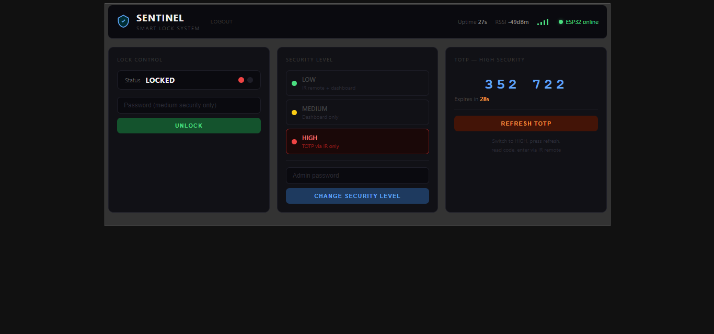
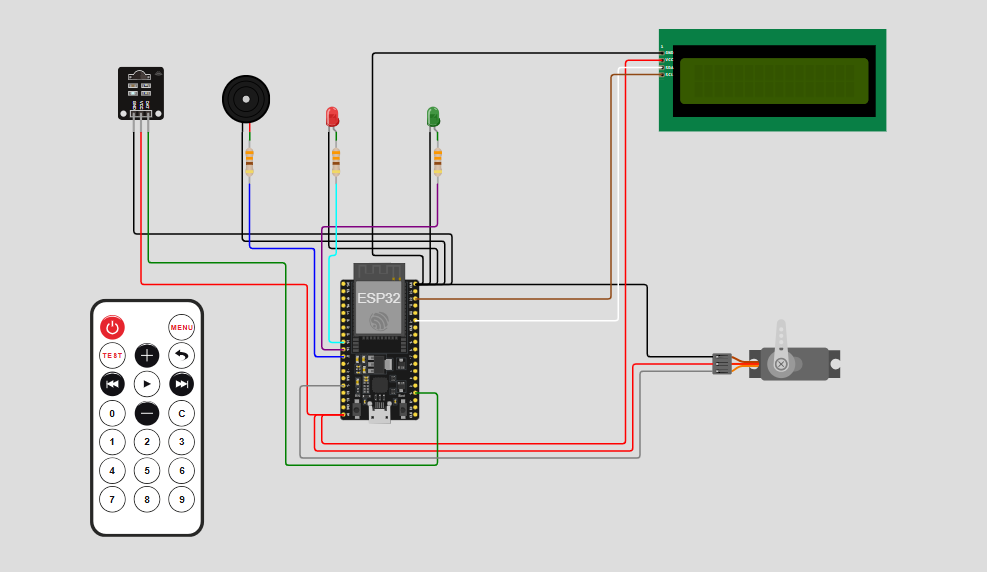

# 🛡️ Sentinel — Smart Lock System

A multi-layer IoT security system built on ESP32 with MQTT over TLS, featuring three security levels, TOTP authentication, and a custom Node-RED dashboard.

---

## 📸 Screenshots

| Dashboard | Login |
|-----------|-------|
|  |  |

**Circuit Diagram**



---

## ✨ Features

- **Three Security Levels** — LOW, MEDIUM, and HIGH, switchable from the dashboard
- **IR Remote Entry** — Enter password via IR remote, displayed live on LCD
- **TOTP Authentication** — Time-based One-Time Password for HIGH security mode
- **MQTT over TLS** — Encrypted communication between ESP32 and Raspberry Pi broker
- **Custom Dashboard** — Dark-themed Node-RED dashboard with login, live status, and controls
- **OTA Updates** — Flash new firmware wirelessly via ArduinoOTA
- **Lockout Protection** — 5 consecutive failures trigger buzzer alert and dashboard notification
- **Live Monitoring** — ESP32 uptime, RSSI signal strength, and online/offline status on dashboard

---

## 🔐 Security Levels

| Level | IR Remote | Dashboard | Authentication |
|-------|-----------|-----------|----------------|
| 🟢 LOW | ✅ Password | ✅ Direct unlock | 6-digit password |
| 🟡 MEDIUM | ❌ Disabled | ✅ Password required | 6-digit password |
| 🔴 HIGH | ✅ TOTP only | 👁️ View TOTP code | Time-based OTP |

---

## 🛠️ Hardware

| Component | Details |
|-----------|---------|
| Microcontroller | ESP32 WROOM-32 (38-pin DevKit) |
| Display | 16x2 LCD with I2C module (0x27) |
| Remote | IR Receiver + NEC remote |
| Actuator | SG90 Servo Motor |
| Indicators | Red LED, Green LED, Buzzer |
| Broker | Raspberry Pi running Mosquitto |

### Pin Configuration

| Component | GPIO |
|-----------|------|
| IR Receiver | 15 |
| Red LED | 25 |
| Green LED | 26 |
| Buzzer | 27 |
| Servo | 13 |
| LCD SDA | 21 |
| LCD SCL | 22 |

---

## 🏗️ Architecture

```
IR Remote ──→ ESP32 ──→ MQTT/TLS ──→ Raspberry Pi Mosquitto ──→ Node-RED Dashboard
                ↑                                                        │
                └────────────────── Commands ────────────────────────────┘
```

---

## 📦 Libraries

### ESP32 (Arduino IDE)
- `IRremote` by shirriff
- `LiquidCrystal_I2C` by Frank de Brabander
- `PubSubClient` by knolleary
- `ArduinoJson` by bblanchon
- `ESP32Servo` by Kevin Harrington
- `TOTP` by Luca Dentella
- `WiFi`, `WiFiClientSecure`, `ArduinoOTA` (built-in)

### Node-RED
- `node-red-dashboard`
- `node-red-contrib-ui-led`

---

## ⚙️ Setup

### 1. Raspberry Pi — Mosquitto Broker
```bash
sudo apt install mosquitto mosquitto-clients
```
Configure TLS with your own CA and server certificates. Place them in `/etc/mosquitto/certs/`.

### 2. ESP32 Firmware
Open `ESP32/ESP32.ino` in Arduino IDE and fill in:
```cpp
const char* ssid         = "YOUR_SSID";
const char* wifiPassword = "YOUR_WIFI_PASSWORD";
const char* mqtt_server  = "YOUR_RPI_IP";
const char* ca_cert      = "YOUR_CA_CERT";
```

Change the passwords:
```cpp
const String lockPassword  = "YOUR_LOCK_PASSWORD";   // 6 digits
const String adminPassword = "YOUR_ADMIN_PASSWORD";  // 6 digits
```

Flash to ESP32 via USB or OTA.

### 3. Node-RED Dashboard
- Import `Dashboard/NodeRedFlow.json` into Node-RED
- Configure the MQTT broker node with your Pi's IP, credentials, and CA certificate
- Paste `Dashboard/SentinelDashboard.html` into the template node
- Set dashboard password in the HTML: `var DASHBOARD_PASSWORD = 'your_password'`
- Deploy

---

## 🔒 Security Notes

- All MQTT communication is encrypted via TLS (port 8883)
- Mosquitto requires username/password authentication
- Node-RED editor is protected with separate admin credentials
- Dashboard has its own login overlay (client-side, for demo purposes)
- TOTP codes are valid for 30 seconds and generated using NTP time

---

## 📁 Repository Structure

```
Sentinel/
├── ESP32/
│   └── ESP32.ino
├── Dashboard/
│   ├── NodeRedFlow.json
│   └── SentinelDashboard.html
├── Images/
│   ├── Dashboard.png
│   ├── DashboardLogin.png
│   └── Circuit.png
└── README.md
```

---

## 🧰 Built With

- **ESP32** — Main microcontroller
- **Mosquitto** — MQTT broker on Raspberry Pi
- **Node-RED** — Dashboard and flow automation
- **Arduino IDE** — Firmware development

---

## 📄 License

MIT License — see [LICENSE](LICENSE) for details.

---

*Built as a learning project exploring IoT security, MQTT, TLS, and embedded systems.*